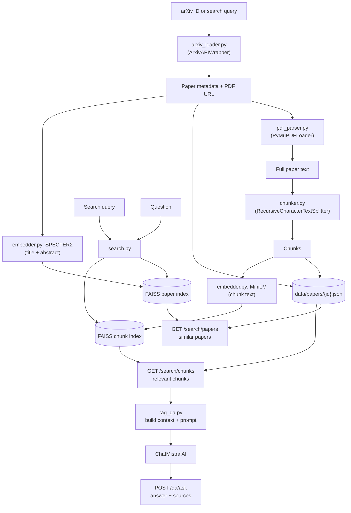

# AI Research Paper Explorer

Semantic search, recommendation, and RAG-based QA over arXiv papers,
built on LangChain: `ArxivAPIWrapper` for fetching papers, `FAISS` for
vector search, and `ChatMistralAI` for grounded question-answering.

## Status: full pipeline complete

Ingest → chunk → embed → index → search → RAG-answer, all wired end to
end through FastAPI.

## Architecture



## Setup

\```bash
pip install -r requirements.txt
cp .env.example .env          # add MISTRAL_API_KEY -- only needed for /qa/ask
uvicorn app.main:app --reload
\```

Interactive API docs: http://127.0.0.1:8000/docs

## Try it

**1. Ingest a paper** (by arXiv ID, or by search query):

\```bash
curl -X POST http://127.0.0.1:8000/ingest/arxiv \
  -H "Content-Type: application/json" \
  -d '{"arxiv_id": "1706.03762"}'
\```

**2. Find similar papers:**

\```bash
curl "http://127.0.0.1:8000/search/papers?query=attention+mechanisms+for+long+sequences&k=5"
\```

**3. Search within ingested paper text** (optionally scoped to one paper):

\```bash
curl "http://127.0.0.1:8000/search/chunks?query=how+is+attention+computed&paper_id=1706.03762"
\```

**4. Ask a grounded question** (requires `MISTRAL_API_KEY`):

\```bash
curl -X POST http://127.0.0.1:8000/qa/ask \
  -H "Content-Type: application/json" \
  -d '{"question": "What does this paper propose instead of recurrence?", "paper_id": "1706.03762"}'
\```

Each ingested paper is saved to `data/papers/{arxiv_id}.json` with its
metadata and chunks. FAISS indices persist under `data/faiss_paper_index/`
and `data/faiss_chunk_index/`.

## Project structure

\```
app/
├── main.py                     # FastAPI app + router wiring
├── config.py                   # Centralized settings (env-driven)
├── models/schemas.py           # Pydantic models: Paper, Chunk, request/response I/O
├── services/
│   ├── arxiv_loader.py         # arXiv fetch/search, via LangChain's ArxivAPIWrapper
│   ├── pdf_parser.py           # PDF download + text extraction, via LangChain's PyMuPDFLoader
│   ├── chunker.py              # Text splitting, via LangChain's RecursiveCharacterTextSplitter
│   ├── embedder.py             # Two embedding models: SPECTER2 (papers), MiniLM (chunks)
│   ├── vector_store.py         # FAISS index lifecycle: create/load/persist
│   ├── search.py               # Paper-to-paper and question-to-chunk retrieval
│   └── rag_qa.py               # Grounded answer generation (ChatMistralAI)
└── api/routes/
    ├── ingest.py                # POST /ingest/arxiv
    ├── search.py                # GET /search/papers, GET /search/chunks
    └── qa.py                    # POST /qa/ask
\```

## Design notes

- **Two separate embedding models, two separate FAISS indices** — not
  one. Paper-to-paper similarity (SPECTER2, on title+abstract) and
  question-to-chunk retrieval (a general sentence-transformer) are
  different tasks; SPECTER2 isn't suited to embedding arbitrary
  paragraph-length chunks, and their embedding spaces aren't comparable.
- **Chunking is character-based** (`RecursiveCharacterTextSplitter`),
  matching `config.py`'s `chunk_size`/`chunk_overlap` units. It prefers
  splitting at paragraph and sentence boundaries before falling back to a
  hard character cut.
- **FAISS is the index; JSON files under `data/papers/` are the source of
  truth.** FAISS's docstore only holds the text that was embedded plus a
  minimal ID — full metadata is hydrated from disk after retrieval, so
  there's one place data can get out of sync, not two.
- **Blocking calls are offloaded with `asyncio.to_thread`** wherever a
  route touches something synchronous under the hood: arXiv API calls,
  PDF downloads, local embedding inference, and the Mistral API call all
  block the calling thread, and none of the underlying libraries offer a
  native async interface here.

## Known limitations

Documented honestly rather than silently left for someone to discover:

- **SPECTER2 is used without its official adapter.** `allenai/specter2_base`
  is designed to be paired with the `adapters` library and a task-specific
  adapter for its published citation-clustering quality. This project
  loads it as a plain sentence-embedding model instead — it works, but
  paper-similarity quality may be below SPECTER2's benchmarked numbers.
  Worth revisiting once real retrieval quality can be evaluated.
- **No upsert support for re-ingesting a paper.** FAISS's LangChain wrapper
  doesn't cleanly handle adding a document with an ID that already exists
  in the index. Re-ingesting the same `arxiv_id` twice is unhandled.
- **`IngestRequest`'s "provide exactly one of arxiv_id or query" rule is
  enforced in the route handler, not on the schema itself.** A
  `model_validator` on `IngestRequest` would be the more idiomatic place
  for this and would surface as a standard `422` instead of a hand-raised
  `400`.
- **No CORS, auth, rate limiting, or global exception handling.** Fine for
  local development and testing; all of these would need addressing before
  any real deployment.